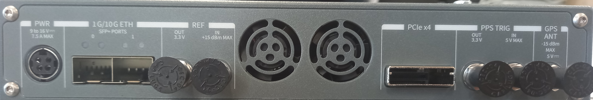

# USRP-2945 Setup
## Pre-Order
### Passive Operational Features  
| Parameter                    | Value             |
|:----------------------------:|:-----------------:|
| Channels                     | 2Tx + 2Rx         |
| Frequency Range              | 10MHz - 6GHz      |
| Gain Range (Step)            | 0 - 37.5 (0.5) dB |
| Maximium Input Power         | -15 dBm           |
| Noise Figure                 | 5 - 7 dB          |
| Max. Instantaneous Bandwidth | 160MHz            |
| Max. I/Q Sample Rate         | 200 MS/s          |
| ADC resolution               | 14 bits           |
## Arrival
### The front panel
- 2 x Rx Channel
    - TX1 RX1 - "Input and output terminal for the RF signal. TX1 RX1 is an SMA (f) connector with an impedance of 50 Ω and is a single-ended input or output channel."
- 2 x Tx Channel
    - RX2 - "Input terminal for the RF signal. RX2 is an SMA (f) connector with an impedance of 50 Ω and is a single-ended input channel."
- Aux I/O
    - "General-purpose I/O (GPIO) port. AUX I/O is controlled by the FPGA."
- JTAG
    - "A USB port that connects the host computer to the device FPGA for recovery purposes. This port can be used with the Xilinx iMPACT configuration tool to temporarily load a new bitfile."

### The back panel
- Power
- 1G/10G ETH
    - "Two SFP+ input terminals used for 1G ETH or 10G ETH connectivity with the host driver. Not currently supported in LabVIEW FPGA."
- REF OUT
    - "Output terminal for an external reference signal for the LO on the device. REF OUT is a female SMA connector with an impedance of 50 Ω, and it is a single-ended reference output. The output signal at this connector is 10 MHz at 3.3 V."
- REF IN
    - "Input terminal for an external reference signal for the LO on the device. REF IN is a female SMA connector with an impedance of 50 Ω, and it is a single-ended reference input. REF IN accepts a 10 MHz signal with a minimum input power of 0 dBm (0.632 Vpk-pk) and a maximum input power of 15 dBm (3.56 Vpk-pk) for a square wave or sine wave."
- PPS TRIG OUT
    - "Output terminal for the pulse per second (PPS) timing reference. PPS TRIG OUT is a female SMA connector with an impedance of 50 Ω, and it is a single-ended input. The output signal is 0 V to 3.3 V TTL. You can also use this port as triggered output (TRIG OUT) that you program with the PPS Trig Out I/O signal."
- PPS TRIG IN
    - "Input terminal for pulse per second (PPS) timing reference. PPS TRIG IN is a female SMA connector with an impedance of 50 Ω, and it is a single-ended input channel. PPS TRIG IN accepts 0 V to 3.3 V TTL and 0 V to 5 V TTL signals. You can also use this port as a triggered input (TRIG IN) that you control using NI-USRP software."
- GPS ANT
    - "Input terminal for the GPS antenna signal. GPS ANT is a female SMA connector with a maximum input power of -15 dBm and an output of DC 5 V to power an active antenna. If not used, do not terminate!"
- PCIe x4
    - "Port for a PCI Express Generation 1, x4 bus connection through an MXI Express four-lane cable."

### How JBs passive radar operated
There is no regular ethernet port for connecting via network, which was suggested in MatLab setup tutorial. It would be required to have a SFP+ to ethernet adaptor, but it is not clear and no expierence is had if this will work.

This is how JB's passive radar hardware is set up. It uses the PCIe x4 connector.

They use a NI ExpressCard-8360B {0} to conntect from the PCIe to a laptop. Old laptops contain a slot for this, but many modern ones do not. It appears this item is no longer manufactured, but with a good few second hand and surplus retailers as options (e.g. [ExpressCard (BMI Surplus)](https://bmisurplus.com/product/national-instruments-express-card-8360-mxi-express-interface-card/), or Ebay).

An adaptor for accepting this outdated express port used by JB {1} is a 'Sonnet Echo ExpressCard/34 Thunderbolt Adapter', [Thunderbolt Adaptor (Eastwood Sound and Vision](https://www.eastwoodsoundandvision.com/sonnet-echo-expresscard-34-thunderbolt-adapter)), that is retailed although not widely. 

This requires another component to interface to a laptop {2} a thunderbolt-3 (usb-c) to thunderbolt-2 (PCIe / Displayport Mini) adaptor, the one used by JB is [Thunderbolt adaptor (StarTech)](https://www.startech.com/en-gb/usb-hubs/tbt3tbtadap). 

### Options for this work 
The options for this project's solution are A) to repeat JBs work, or B) figure out using the 10GB Ethernet port. 
#### Option A - Copy JB
Tried and tested on the 2950R, can discuss with both (MA and JB) if we can test if the same components work on this. 
This will work with LabView, but possibly not Matlab as it is not a network connection. 
The cost and shipping process is broken down as follows.

| Item                             | Cost | Supply Chain                    | Comment                            |
|:--------------------------------:|:----:|:-------------------------------:|:----------------------------------:|
| NI ExpressCard                   | ~400 | Second Hand, Surplus Site, Ebay | NI product, no longer manufactured |
| ExpressCard->Thunderbolt Adaptor | ~150 | Not Obvious, Not Catalogue      |                                    |
| Thunderbolt 3->2 Adaptor         | ~120 | StarTech                        |                                    |

 Reach out to NI to see what 21st century options they have is a possibility. 

#### Option B - Use 10G Eth (SFP+) port
From specification, this will not work with LabView. So Matlab and GNU Radio are the remaining, untested, choices. MatLab would be very nice, but GNU Radio I am a bit scared to start the process on Windows, as there will be undocumented bugs and issues where advice to resolve is going to be to just use ubuntu. A dedicated ubuntu laptop for this would be good to have, and for other devices, but if needing to give this to ESA then perhaps another way would be better. If the TWG issue gets resolved soon, I could borrow that desktop for setup, and later find a solution that will allow setup in Greece. 

A SFP+ transceiver could possibly work and allow a regular ethernet cable to operate the device, possibly [this](https://www.fs.com/uk/products/66612.html) device (£78) or similar. This however will only be 1G, and not 10G. I believe 10GB/s is required for our data rate but requires confirmation

#### Resolution WIP
To Do:
OPTION A 
- [ ] Contact Ettus if there is a 21st centry solution for their products
- [ ] Find a direct cable PCIe4 -> Usb-c.
- [ ] Find legit suppliers for the other options (ebay has worked before)

OPTION B
- [ ] Buy a SFP+ transeiver to ping device, and setup matlab.
- [ ] Check if 10G ethernet input is possible on my laptop (ethernet or usb-c aka thunderbolt 3, or via docking station)

## Construction

The 