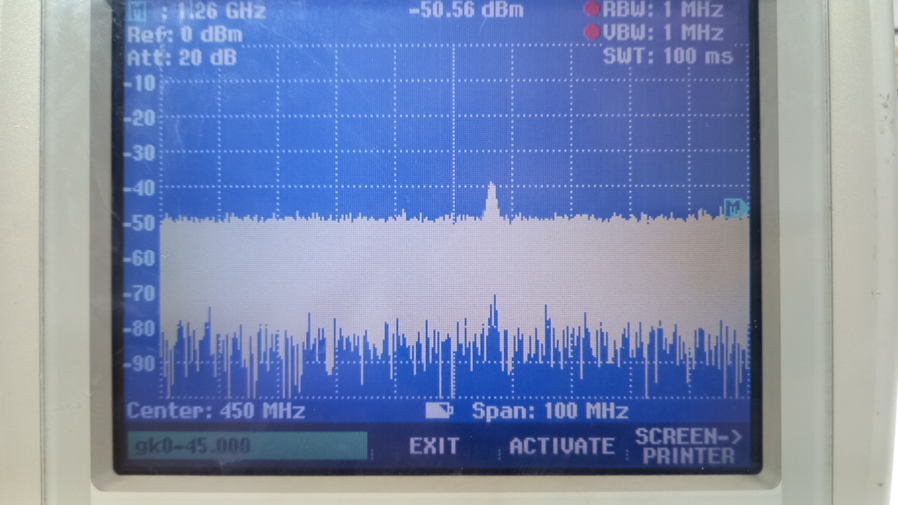
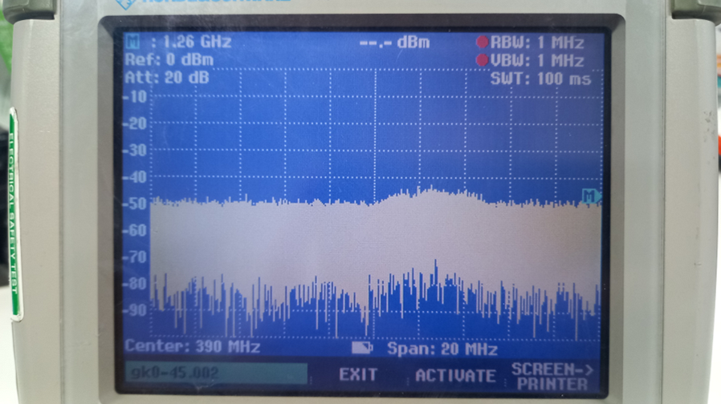
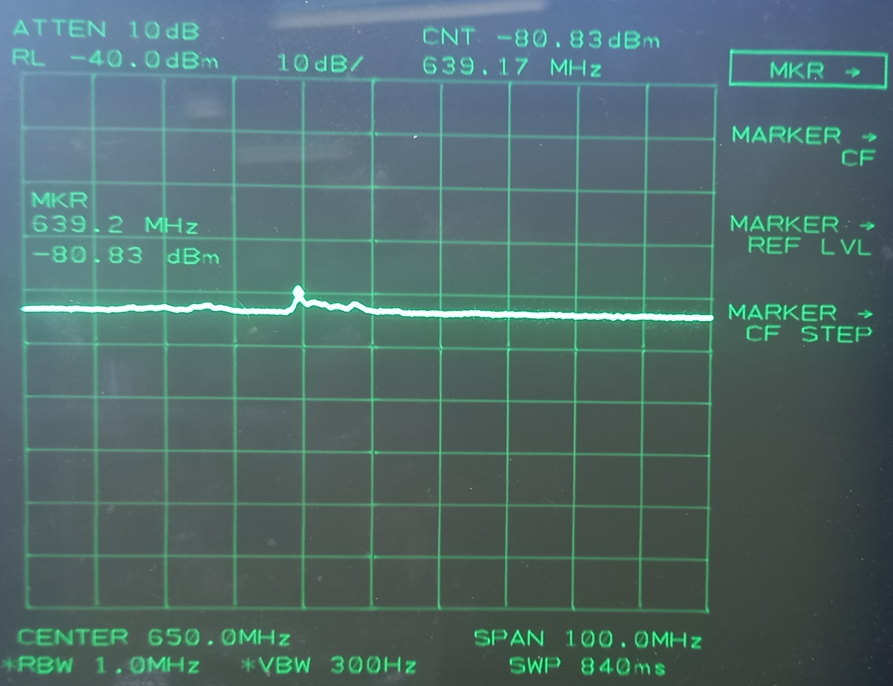
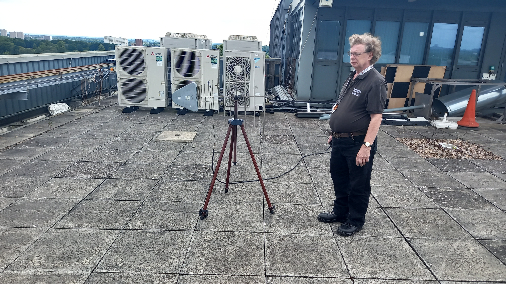
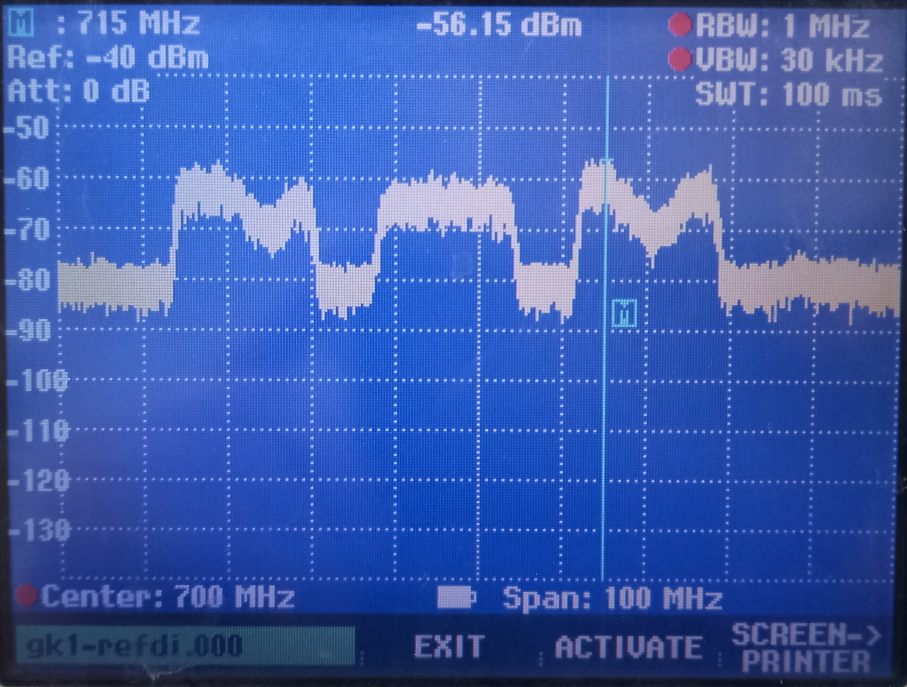
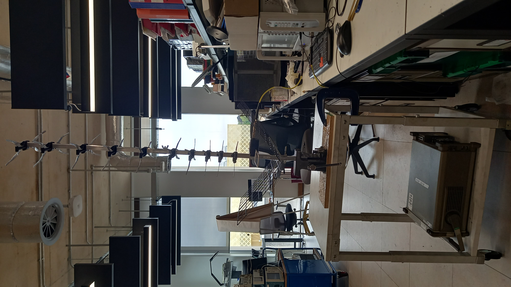
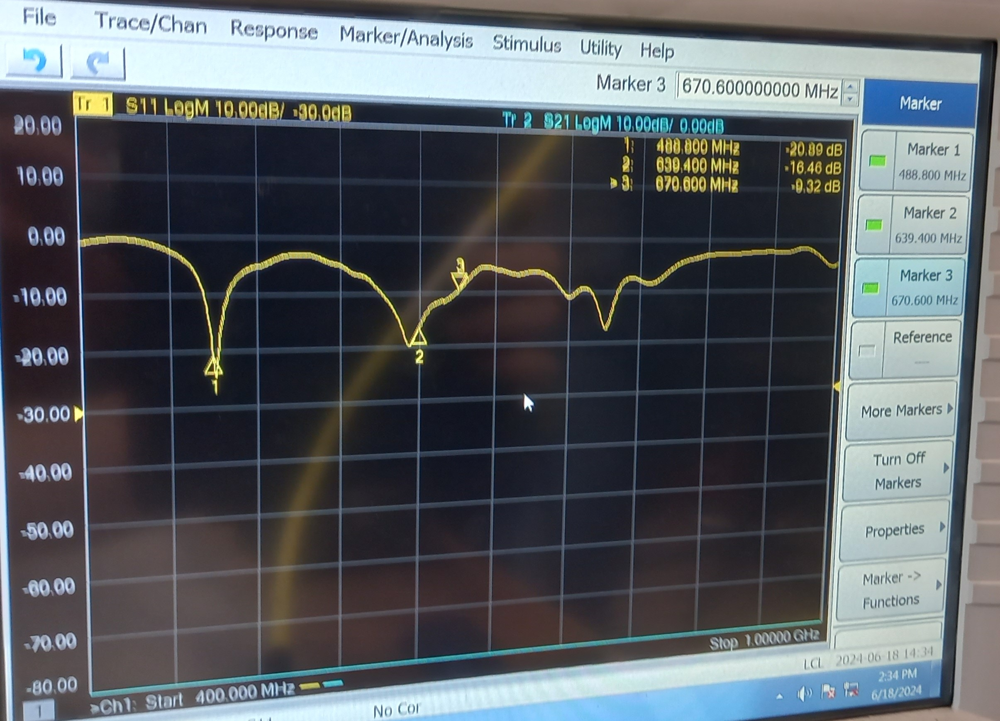

# Spectral Analysis for SCTS @ Gisbert-Kapp
This document is for the Sutton-Coldfield Transmitting Station (SCTS) information and measurements.  

## SCTS Channels

  
  
## Measurements

### Spectral Analysis w/ Dipole @ Gisbert-Kapp Roof (2024-06-13)

### Spectral Analysis /w Log-Harmonic @ 328 Lab Preparation
The Yagi-Uda antenna is first characterised using the VNA between 300MHz-1GHz. 
Observed -20dB insertion loss with $S_{11}$ between 400MHz - 1GHz.
The (Joe's) Patch Antenna (below) performed better than the Yagi-Uda in indoors in the well sheilded Rm328.

 
### Spectral Analysis /w Reference Dipole @ Gisbert-Kapp Roof (2024-06-18)
Failed to observe more than 5dB above noise floor of any signal between 400-1GHz, which leads us to suspect that the antenna is faulty. [^1]

This was confirmed with the check of using the small reference dipole antenna and otherwise identical setup. 

This revealed many DVB-T peaks at -57dBm, 15-20dB above the noise floor. This achieved with a small reference dipole promisies about 25dB SNR surveillance channel with a properly setup, high gain antenna.

| Found        | Frequency | $P_t$ | SNR |
|:------------:|:---------:|:-----:|:---:|
| NO           | 618.166   | 200kW |     |
| NO           | 626.166   | 200kW |     |
| YES          | 642       | 200kW | 20  |
| YES - Weaker | 650       | 200kW | 15  |
| NO           | 666       | 200kW |     |
| YES          | 674       | 200kW | 20  |
| YES          | 690       | 200kW | 20  |

Comparing the peaks of "GKroof Ref. Dipole 600-800MHz", it appears that not all of the expected signals are being measured. (Perform a full peak comparison using better sweeps and antenna later.) Perhaps the wikipedia article is out of date.

### Repairing and Characterising Yagi-Uda (2024-06-18--19)
Found Large Yagi-Uda in old Gisbert-Kapp stock room. 
Required repairs or updates required: 

- [x] Find F-Type connector to N- and SMA type. 
- [x] Re-attach reflector.
- [x] Align teeth uniformly. 

== TODO | Place all charactisation of components into a separate document ==
==(Cable, adaptors, antennas,)==

The return loss, $S_{11} = (-)5 - 15$ dB, is acceptable in Alan's experience. 
**==TODO | Check why the optimum return loss is dB(75$\Omega$ / 50$\Omega$ ~= 14dB maximum loss from termination mismatch) ==** 

Next task is to characterise the gain of the antenna, wrt _dBd_, by finding the increase in signal level when the reference dipole antenna is replaced with the Yagi-Uda. 
...

### Understanding and Operating the FSH6 (with PreAmp)
To ensure that we are able to measure signals at the site of Kryoneri, the use of a pre-amp is very useful to ensure the signals will be detected and maximised if they are present. We will be using a preamp for both reference and surveillance channels for the radar, so the same should be done in this initial case of ambient signal characterisation. I need to ensure the FSH6 **indeed possesses** a pre-amplifier, and to establish what the increase in gain is, if this is toggleable, and with a collection of antenna.
...
[^1]: Images show antenna in vertical mode. Horizontal orientation was attempted and did not improve results noticably. The tripod requires a fix to hold it upright in horizontal. Need to fix for the fixed-up Yagi-Uda to try next.